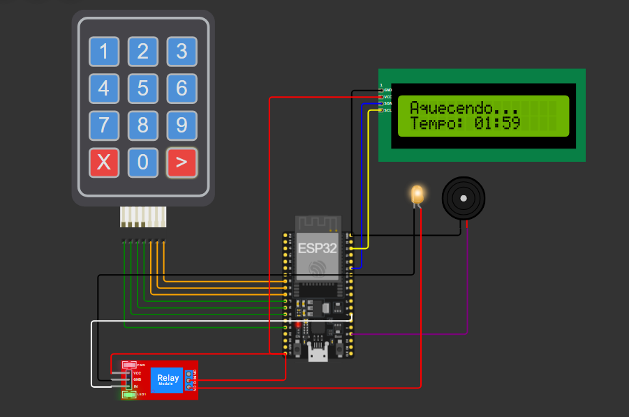

# Processo Seletivo – Intensivo Maker | IoT | Micro-ondas

### 👤 Identificação do Candidato

- **Nome completo:**  Guilherme Viana Batista
- **GitHub:**  [guiogigo](https://github.com/guiogigo)

---

## 1️⃣ Introdução
Este projeto engloba o desenvolvimento do software e a simulação de hardware para um controlador de micro-ondas inteligente. Utilizando a plataforma Wokwi, o sistema foi programado em MicroPython para o microcontrolador ESP32. O objetivo do projeto é demonstrar proficiência no desenvolvimento de sistemas embarcados, aplicando conceitos de arquitetura de software, interfaces de utilizador e controle de hardware em tempo real.

## 2️⃣ Arquitetura do Sistema
A base lógica do controlador foi estruturado sobre uma **Máquina de Estados Finitos**. Esta estrutura garante robustez, evitando comportamentos inesperados. Os estados implementados são:
* **S_AGUARDANDO (0):** Sistema em repouso. O display aguarda a entrada do usuário.
* **S_CONFIGURANDO (1):** O usuário introduz o tempo de aquecimento. O sistema processa os dígitos limitados a uma margem segura e converte para o formato visual `MM:SS`, ao dar start por meio da tecla `>` o sistema começa a rodar.
* **S_RODANDO (2):** O relé e o led, aqui utilizados para simular o magnetron presente em micro-ondas reais, são ativados. A contagem regressiva ocorre de forma assíncrona.
* **S_FINALIZADO (3):** Tempo esgotado. O relé desliga e alertas sonoros não-bloqueantes são acionados antes de retornar ao estado de repouso.
* **S_PAUSADO (4):** O utilizador interrompe o processo momentaneamente usando a tecla `X`. O relé é desligado, mas o tempo restante é memorizado no display, aguardando cancelamento definitivo, usando novamente a tecla `X` ou retomada do aquecimento, utilizando a tecla de start `>`.

## 3️⃣ Componentes Utilizados na Simulação
Conforme modelado no `diagram.json`, os periféricos integrados ao ESP32 são:
* **Membrane Keypad (Customizado 3x4):** Interface de entrada mapeada para funções específicas (`0-9`, `X` para Cancelar/Pausar, e `>` para Iniciar/Retomar).
* **LCD 16x2 (I2C):** Fornece uma representação visual dinâmica. A escolha partiu de um trade-off, pois o LCD padrão utiliza de 6 a 10 pinos enquanto o IC2 é reduzido apenas para 2, porém utilizando o IC2 perdemos velocidade e aumentamos o número de bibliotecas carregas. Como a velocidade não é importante para o projeto, o trade-off é aceitável.
* **Módulo Relé & LED Laranja:** O relé atua como a chave de potência, acendendo o LED Laranja para simular o funcionamento do magnetron (emissor de micro-ondas).
* **Buzzer:** Atuador sonoro para aviso de conclusão do timer de aquecimento.

## 4️⃣ Decisões Técnicas Relevantes
* **Temporização Não-Bloqueante (`time.ticks_ms`):** Em vez de utilizar `time.sleep()`, que congela o processador, implementou-se a medição da diferença de "ticks".  Isso permite que o microcontrolador varra o teclado continuamente. Caso ocorra uma emergência e o utilizador pressione `X`, a **paragem do micro-ondas é instantânea**, aumentando a segurança e responsividade do equipamento em comparação com abordagens bloqueantes.
* **Formatação Visual do Tempo (`MM:SS`):** Foram criadas funções de conversão matemática (`counter_converter` e `second_converter`). Em vez de exigir que o utilizador pense em segundos brutos, o display apresenta uma interface amigável e de fácil entendimento.
* **Debounce por Software:** Implementado um filtro temporal de 200ms na leitura do teclado. Elimina o ruído mecânico virtual "bouncing", garantindo que um toque na tecla não seja registado múltiplas vezes de forma indesejada.

## 5️⃣ Resultados Obtidos
A simulação cumpre os requisitos propostos:
* Transições de estado precisas (Aguardando ➔ Configurando ➔ Aquecendo ➔ Pausado ➔ Finalizado).
* O display LCD atualiza a formatação temporal corretamente em tempo real.
* A interrupção de processos (Pausa/Cancelamento) atua de imediato.
* Comunicação estável com o LCD 16x2 utilizando apenas 2 pinos (SDA/SCL).
* Leitura do teclado 4x3 com tratamento de *debounce*.

## 6️⃣ Comentários Adicionais

**Dificuldades Encontradas:**
* **Integração de Drivers Específicos:** Uma dificuldade interessante foi a necessidade de incluir a biblioteca externa do LCD (`lcd.py`) dentro do  `Dockerfile` para que os testes automatizados do GitHub Actions reconhecessem o display sem gerar `ImportError`.
* **Lógica de Conversão Numérica:** Lidar com a entrada crua dos números e realizar a matemática de base-60 para a transição de minutos e segundos exigiu certo cuidado para evitar bugs visuais no display.

**Principais Aprendizados:**
* **O Valor da Responsividade em Embarcados:** O contraste entre usar `sleep()` e `ticks_ms()` evidenciou como a arquitetura do código impacta a segurança do hardware físico. Um código bloqueante num equipamento real poderia resultar em acidentes.
* **Escalabilidade com FSM:** A utilização da Máquina de Estados tornou incrivelmente fácil adicionar a funcionalidade nova de "Pausar" (`S_PAUSADO`). Sem a FSM, adicionar esta funcionalidade no código seria propenso a falhas graves.